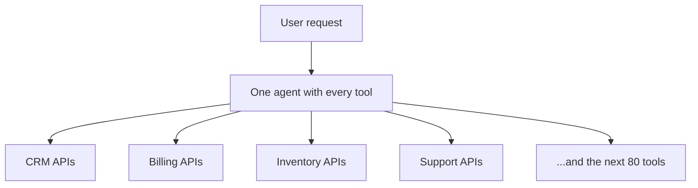
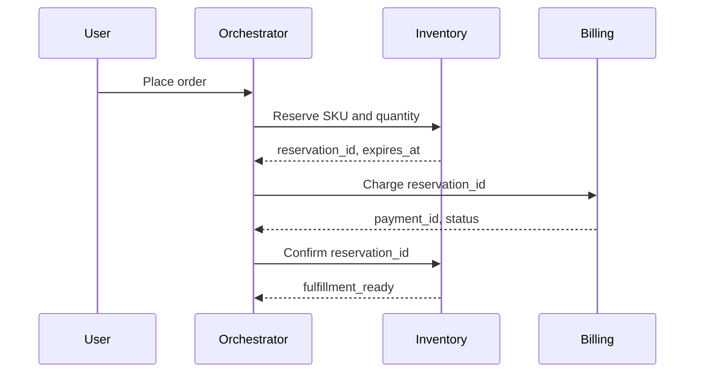

Getting an agent to call a few tools is not the hard part anymore. Pick a model, expose some functions, write a prompt, and the demo works on the first try.

The hard part shows up after that, when the agent has to route a real request across a real business: which tools to touch, in what order, with whose data, and what happens when step three fails after step two already committed. That's where token cost and failure rate both start climbing, usually at the same time.

The fix isn't a smarter prompt. It's closer to what an operating system does for a process: decide who runs, what they're allowed to see, how they hand off to each other, and what happens when one of them dies mid-task.

## The shape that fails

Most agent systems start the same way: one agent, every tool, one prompt trying to explain billing, inventory, CRM, and support all at once.

It holds up right until a request crosses two domains. "Refund the customer, but only if the shipment never left the warehouse" isn't a tool-calling problem, it's an ownership problem. Billing shouldn't be inventing inventory policy. Inventory shouldn't be authorizing a charge. In the single-agent version, one prompt does both, with whatever context happened to survive that turn's window.

You pay for that in tokens too. Every tool schema, every policy, every past message sits in the same context whether or not the current step needs it. Most of it doesn't.

## What actually needs deciding

Before any of this is a prompting problem, it's a planning problem, and the model is the least interesting part of it.

Who owns which decision matters more than which tools exist. Refunds, reservations, tickets, and approvals aren't all the same agent's job, and pretending they are is how you end up with a prompt that's really an org chart in disguise. Domains need a way to talk to each other that isn't a shared prompt, structured inputs and outputs instead of a 20-page system message trying to double as an integration bus. And you need an answer for recovery: if payment succeeds and fulfillment fails, "sorry, try again" leaves a charge on someone's card with nothing to show for it.

If those are still fuzzy, no amount of prompt tuning fixes it. The architecture is wrong before the model ever runs.

## What that looks like in practice

A thin orchestrator picks which domain handles the next step. Each domain is its own agent with its own small tool set. Handoffs between them are typed, not prose.

Inventory hands back a reservation id and an expiry. Billing charges against that id, not against a paragraph describing what inventory did. The orchestrator writes both to workflow state, and neither domain needs the other's internal policy in its prompt. Add a new domain later and you write one more contract, not three more paragraphs of "also remember to."

The orchestrator itself doesn't need a hundred tools. It needs to know which domain can reserve stock, issue a refund, or open a ticket, then route, record progress, and decide what happens on failure. Each domain agent loads only its own tools and only the context that step actually needs. That's the whole reason it's cheaper: you stop stuffing the entire company into every call.

## Restarts shouldn't mean redoing

Enterprise workflows commit things. They reserve stock, move money, create tickets. If the agent crashes after the charge goes through and the recovery path replays from the original user message, someone gets charged twice.

The unit of recovery has to be the checkpoint, not the conversation. Reserve stock, charge the customer, create the shipment, notify them, four steps that each persist their result the moment they succeed. If the charge fails, release the reservation and stop. If the shipment fails after the charge went through, refund and release rather than leaving a paid-for order stuck in limbo. On retry, skip whatever already committed and pick up from there.

That's boring distributed-systems work, and agents don't get to skip it just because the interface in front of it is natural language. A process crash isn't supposed to corrupt the disk. An agent crash shouldn't corrupt the business either.

## The point of doing this first

None of this is about elegance. It's the only way these systems stay reliable as the tool count grows past what fits comfortably in one person's head.

A specialist agent with eight tools and a one-page contract is something you can actually debug. A single agent with a hundred tools is a prompt nobody wants to touch, and it uses more context per call for the privilege. Do the ownership, the contracts, and the checkpoints first. The agent sitting on top of that gets to stay small, which was the actual goal the whole time.
